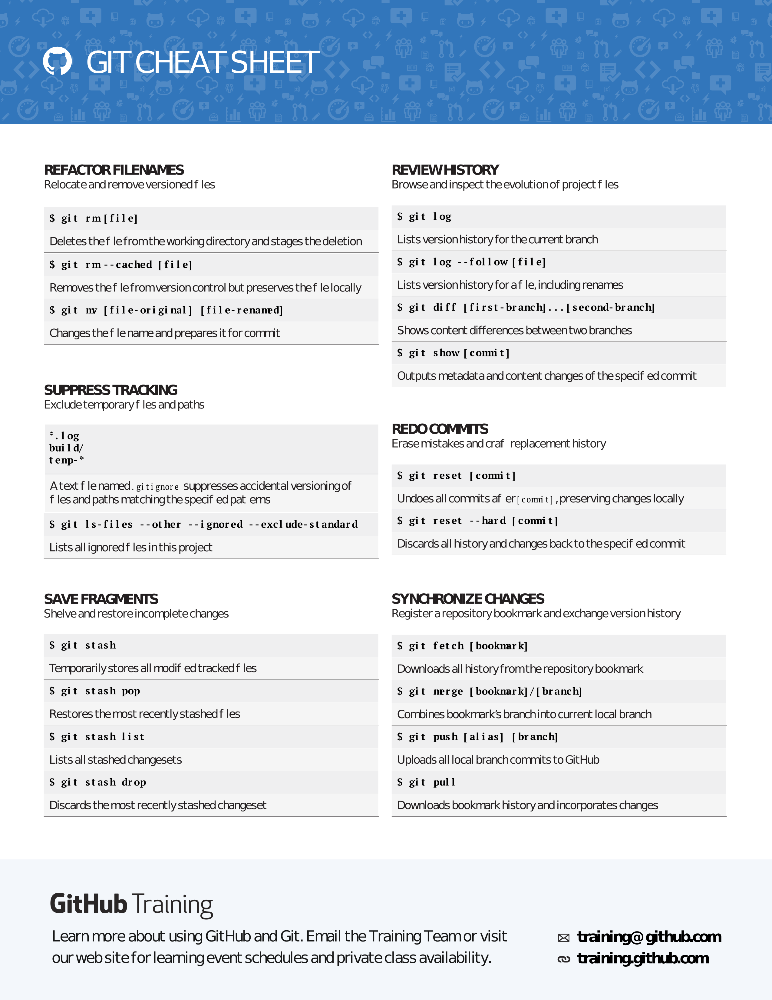
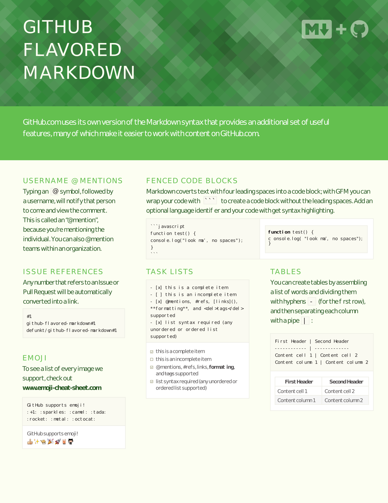

# Pense-betes

## Git

[aller vers](#autres-themes-mkdocs)




## Markdown




## Autres themes Mkdocs

[Autres themes Mkdocs](https://github.com/mkdocs/mkdocs/wiki/MkDocs-Themes)

[TOC]

## Titre

Code dans le texte avec `a = 1`.

```python
a = 1
print(a)
```

---

| Entête 1 | Entête 2 | Entête 3 |
| :-------- | :-------: | --------: |
| Ligne 1, Colonne 1 | Ligne 1, Colonne 2 | Ligne 1, Colonne 3|
| Ligne 2, Colonne 1 | Ligne 2, Colonne 2 | Ligne 2, Colonne 3|
| Ligne 3, Colonne 1 | Ligne 3, Colonne 2 | Ligne 3, Colonne 3|
| vers la gauche | au centre | vers la droite|

